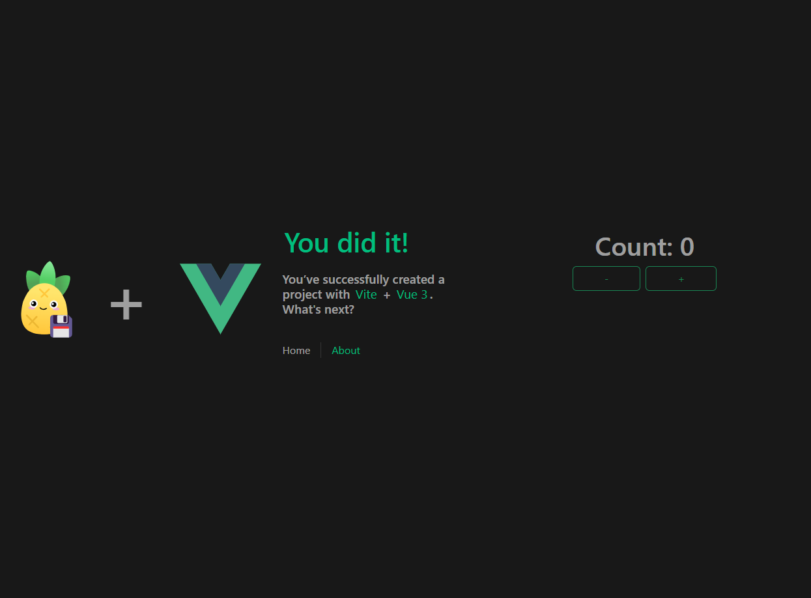
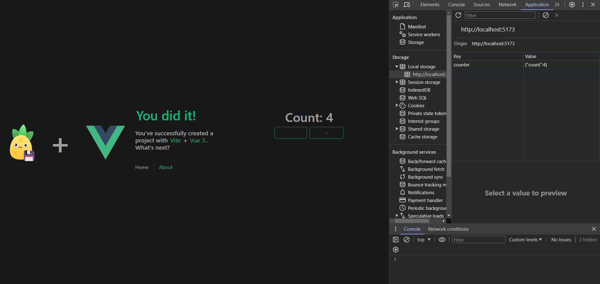

# Pinia Persisted State App

This project was created with the purpose of testing the pinia-plugin-persistedstate library which serves to maintain the state of pinia even if the page is reloaded, it maintains the state in the localStorage.

## Recommended IDE Setup

[VSCode](https://code.visualstudio.com/) + [Volar](https://marketplace.visualstudio.com/items?itemName=Vue.volar) (and disable Vetur) + [TypeScript Vue Plugin (Volar)](https://marketplace.visualstudio.com/items?itemName=Vue.vscode-typescript-vue-plugin).

## Type Support for `.vue` Imports in TS

TypeScript cannot handle type information for `.vue` imports by default, so we replace the `tsc` CLI with `vue-tsc` for type checking. In editors, we need [TypeScript Vue Plugin (Volar)](https://marketplace.visualstudio.com/items?itemName=Vue.vscode-typescript-vue-plugin) to make the TypeScript language service aware of `.vue` types.

If the standalone TypeScript plugin doesn't feel fast enough to you, Volar has also implemented a [Take Over Mode](https://github.com/johnsoncodehk/volar/discussions/471#discussioncomment-1361669) that is more performant. You can enable it by the following steps:

1. Disable the built-in TypeScript Extension
    1) Run `Extensions: Show Built-in Extensions` from VSCode's command palette
    2) Find `TypeScript and JavaScript Language Features`, right click and select `Disable (Workspace)`
2. Reload the VSCode window by running `Developer: Reload Window` from the command palette.

## Customize configuration

See [Vite Configuration Reference](https://vitejs.dev/config/).

## Project Setup

```sh
npm install
```

### Compile and Hot-Reload for Development

```sh
npm run dev
```

### Type-Check, Compile and Minify for Production

```sh
npm run build
```

### Run Unit Tests with [Vitest](https://vitest.dev/)

```sh
npm run test:unit
```

<p align="center">
  
</p>

<p align="center">
  <i>Artwork from <a href="https://pinia.vuejs.org/">Pinia</a></i>
</p>

<h1 align="center">pinia-plugin-persistedstate</h1>
<p align="center">Configurable persistence and rehydration of Pinia stores.</p>

<p align="center">
  <a href="https://www.npmjs.com/package/pinia-plugin-persistedstate">
    
  </a>
  <a href="https://github.com/prazdevs/pinia-plugin-persistedstate/actions/workflows/ci.yml">
    
  </a>
  <a href="https://app.codecov.io/gh/prazdevs/pinia-plugin-persistedstate">
    
  </a>
  <a href="https://github.com/prazdevs/pinia-plugin-persistedstate/tree/HEAD/LICENSE">
    
  </a>
</p>

<p align="center">
  <a href="https://prazdevs.github.io/pinia-plugin-persistedstate/" alt="pinia-plugin-persistedstate docs" >
    
  </a>
</p>

<p align="center">
  <a href="https://prazdevs.github.io/pinia-plugin-persistedstate/" alt="pinia-plugin-persistedstate english docs" >
    English
  </a>
  |
  <a href="https://prazdevs.github.io/pinia-plugin-persistedstate/zh" alt="pinia-plugin-persistedstate chinese docs" >
    简体中文
  </a>
</p>

## ✨ Features

- Persist Pinia stores with a friendly API inspired by [`vuex-persistedstate`](https://github.com/robinvdvleuten/vuex-persistedstate).
- Highly customisable with custom storage, customer serializer, paths picking...
- Compatible with everything that uses Pinia.
- No external dependencies in a tiny package (<1kB gzipped).

## 💡 Example

The following example illustrates how this pinia-plugin-persistedstate library was applied.

### 1. Pinia-plugin-persistedstate must be installed

With NPM:
```ssh
npm i pinia-plugin-persistedstate
```

With Yarn:
```ssh
yarn add pinia-plugin-persistedstate
```

### 2. In the `main.ts` the following lines are added:

piniaPluginPersistedstate is imported from pinia-plugin-persistedstate

```ts
import piniaPluginPersistedstate from 'pinia-plugin-persistedstate'
```

Then an instance of pinia is created and then the piniaPluginPersistedstate is used

```ts
const pinia = createPinia()
pinia.use(piniaPluginPersistedstate)
```

Before mounting the application in the #app, this instance of pinia must be used

```ts
app.use(pinia)
```

The code would look like this

```ts
import './assets/main.css'

import { createApp } from 'vue'
import { createPinia } from 'pinia'
import piniaPluginPersistedstate from 'pinia-plugin-persistedstate'

import App from './App.vue'
import router from './router'

const app = createApp(App)

const pinia = createPinia()
pinia.use(piniaPluginPersistedstate)

app.use(pinia)
app.use(router)

app.mount('#app')
```

### 3. Create a store and put the persist attribute on it

For this example we use a store called useCounterStore which is in `src/stores/counter.ts`

```ts
import { ref } from 'vue'
import { defineStore } from 'pinia'

export const useCounterStore = defineStore('counter', () => {

  const count = ref<number>(0);

  const increment = () => {
    count.value++;
  }
  
  const decrement = () => {
    count.value--;
  }

  return { count, increment, decrement }

});
```

After the second parameter of the defineStore, that is, the function, where the key is closed, we must add the following parameter:

```ts
{ persist: true }
```

The counterStore will look like this:

```ts
import { ref } from 'vue'
import { defineStore } from 'pinia'

export const useCounterStore = defineStore('counter', () => {

  const count = ref<number>(0);

  const increment = () => {
    count.value++;
  }
  
  const decrement = () => {
    count.value--;
  }

  return { count, increment, decrement }

}, { persist: true });
```

### 4. Use the counterStore in a component or screen

Using a page that was already created I made an HTML to use the counterStore, its variables and methods `src/views/HomeView.vue`

```vue
<script setup lang="ts">
import { useCounterStore } from '@/stores/counter';
import { storeToRefs } from 'pinia';
const counterStore = useCounterStore();
const { count } = storeToRefs(counterStore);
</script>

<template>

  <section>

    <h1>Count: {{ count }}</h1>

    <button @click="counterStore.decrement" class="btn btn-outline-success px-5 me-2" data-testid="decrement-button">
      -
    </button>

    <button @click="counterStore.increment" class="btn btn-outline-success px-5" data-testid="increment-button">
      +
    </button>

  </section>

</template>
```

This is what the application looks like running



If we check the localStorage in the application section when inspecting the page we can see that the store counter is saving or changing the count variable, we can reload the page and verify that the state of the page or component is being maintained



## ⚠️ Limitations

There are some limitations that should be considered, more on those [here](https://prazdevs.github.io/pinia-plugin-persistedstate/guide/limitations.html).

## 🤝 Contributing

Run into a problem? Open an [issue](https://github.com/prazdevs/pinia-plugin-persistedstate/issues/new/choose).
Want to add some feature? PRs are welcome!

## 📝 License

Copyright © 2021-present [Sacha Bouillez](https://github.com/prazdevs).
This project is under [MIT](https://github.com/prazdevs/pinia-plugin-PERSISTEDSTATE/blob/main/LICENSE) license.
